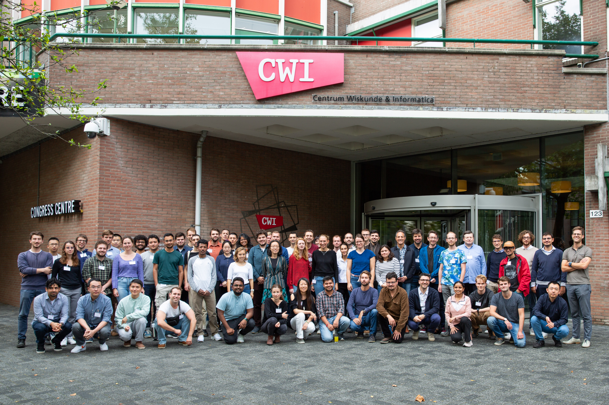

# Workshop, December 2023
Presentations during the workshop on scientific machine learning, 6-8 December 2023, CWI Amsterdam.

## Wednesday 6 December, Scientific computing with machine learning
Machine-learning-enhanced numerical methods, physics-informed machine learning
- Jan Hesthaven (EPFL): [slides](presentations/Hesthaven_CWIWorkshop2023.pdf) 
- Xiaodong Cheng (Wageningen): [slides](presentations/XiaodongCheng.pdf)
- Benjamin Sanderse (CWI): [slides](presentations/Sanderse_closure_models.pdf)
- Stefania Fresca (Milan)
- Richard Dwight (Delft): [slides](presentations/Dwight.pdf)
- Dongwei Ye (Twente)

## Thursday 7 December, Scientific computing for machine learning
Mathematical and computational theories for machine learning

- Sid Mishra (EPFL): [slides](presentations/Mishra.pdf)
- Aron Jansen (eScience center)
- Silke Glas (Twente)
- Andrea Walther (Berlin): [slides](presentations/AndreaWalther.pdf)
- Matthias Möller (Delft)

## Friday 8 December, Scientific machine learning in applications
Hybrid modeling and simulation for large-scale systems

- Dirk Hartmann (Siemens)
- Quercus Hernández Laín (Zaragoza): [slides](presentations/Quercus_Hernandez.pdf)

--- 

# Autumn school, October 2023

Course material for the autumn school in scientific machine learning, 9-13 October 2023, CWI Amsterdam.

## Day 1: Closure models and turbulence
- Andrea Beck: [slides](presentations/cwi_school_andreabeck_content_complete_handout_compressed.pdf)
- Romit Maulik: [slides](presentations/Differentiable_Turbulence.pdf)
- Syver Agdestein, Benjamin Sanderse:
    - [slides](presentations/SanderseAgdestein_closure_models.pdf)
    - [code](https://github.com/agdestein/NeuralClosure)
 
## Day 2: Reduced-order models
- Andrea Manzoni & Mengwu Guo, see [Mengwu's website](https://www.mengwuguo.com/teaching.html)
- Karen Veroy: [slides](presentations/Autumn%20School%20-%20Veroy-Grepl.pdf)

## Day 3: SINDy
- Steve Brunton: [slides](presentations/2023_10_AMS_actual.pdf)
- Urban Fasel:
    - [Matlab code and slides](https://github.com/urban-fasel/CWI_Autumn_School_2023)
    - [Python code PySINDy](https://github.com/dynamicslab/pysindy)
 
## Day 4: Operator and equivariant learning
- Paris Perdikaris: [slides](presentations/slides_paris.pdf)
- Erik Bekkers: [slides and code](https://uvagedl.github.io/)

## Day 5: Differentiable simulators
- Chris Rackauckas [slides](presentations/DifferentiableSimulation_TheRealBits_Rackauckas.pdf)
    - Demonstration that standard uncorrected AD can produced incorrect results on ODE codes [code](presentations/uncorrected_ad.jl)
    - Demonstration code for how PDEBench's Burgers implementation is >100x slower than a proper classical inverse problem simulator and the optimization process [code](presentations/optimized_burgers.jl)
- Hod Lipson: [slides](presentations/AutomatingDiscovery.pdf)
- Benjamin Sanderse: [wrap-up](presentations/Sanderse_wrapup.pdf)

